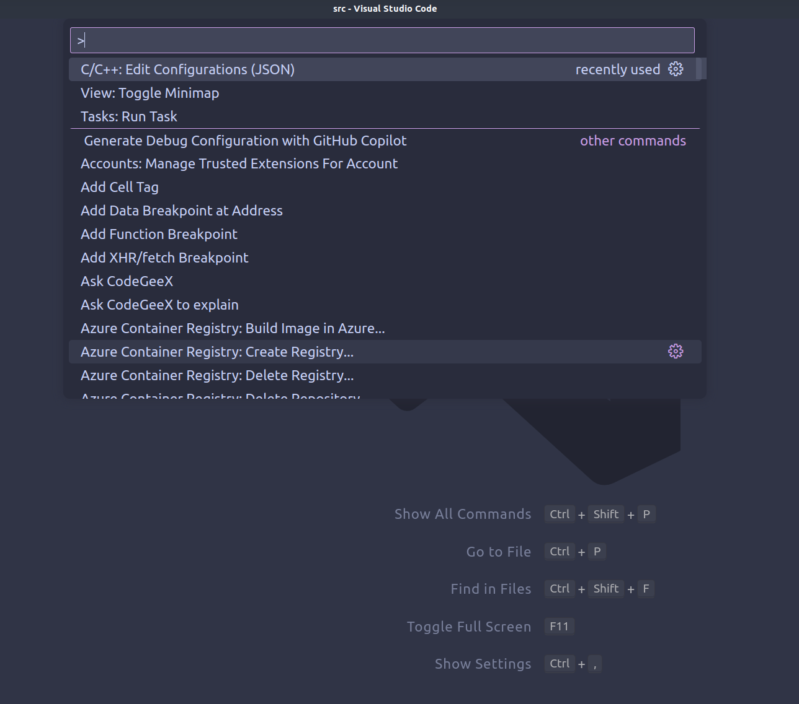
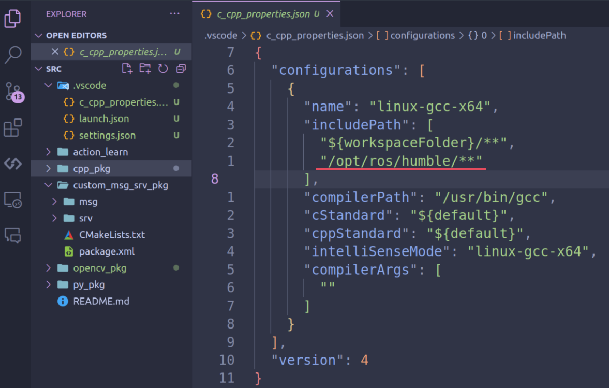
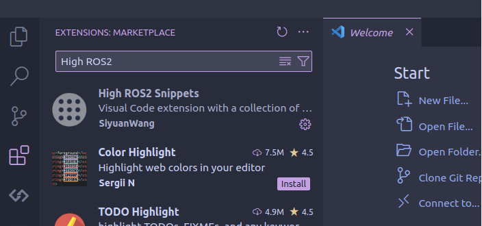
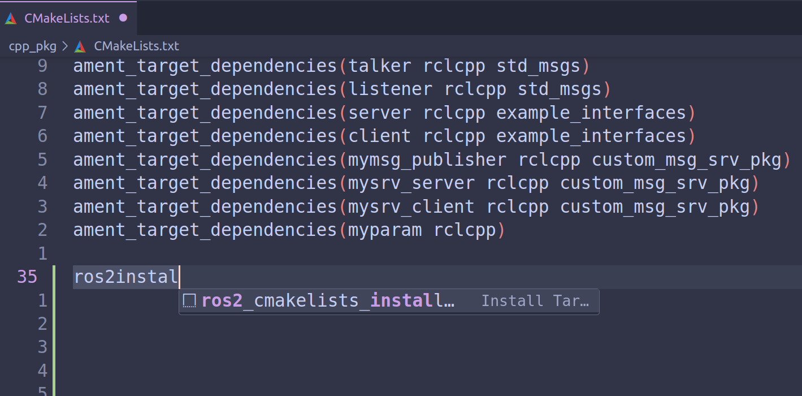
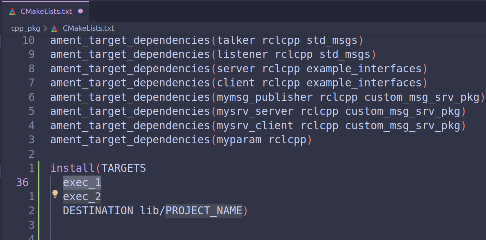

# Setup VSCode for ROS Developing

## 1. 添加ros包的IncludePath：

- `ctrl+shift+p` 打开vscode的控制面板，点击`C/C++: Edit Configurations (JSON)`

 

​	之后在当前目录下会生成`.vscode`文件夹

- 打开`.vscode/c_cpp_properties.json`，在`includePath`中添加ros的路径:

 

之后再编写C++的ROS相关代码时候，就可以使用代码补全功能。

## 2. 安装一些插件辅助编程：

对于ROS编程，有很多重复的代码片段，安装一个代码片段插件会提高代码书写效率。可以在插件市场安装`High ROS2 Snippets`，替补代码片段补全功能:

 

​	之后便可以使用代码片段补全功能，如:

  

