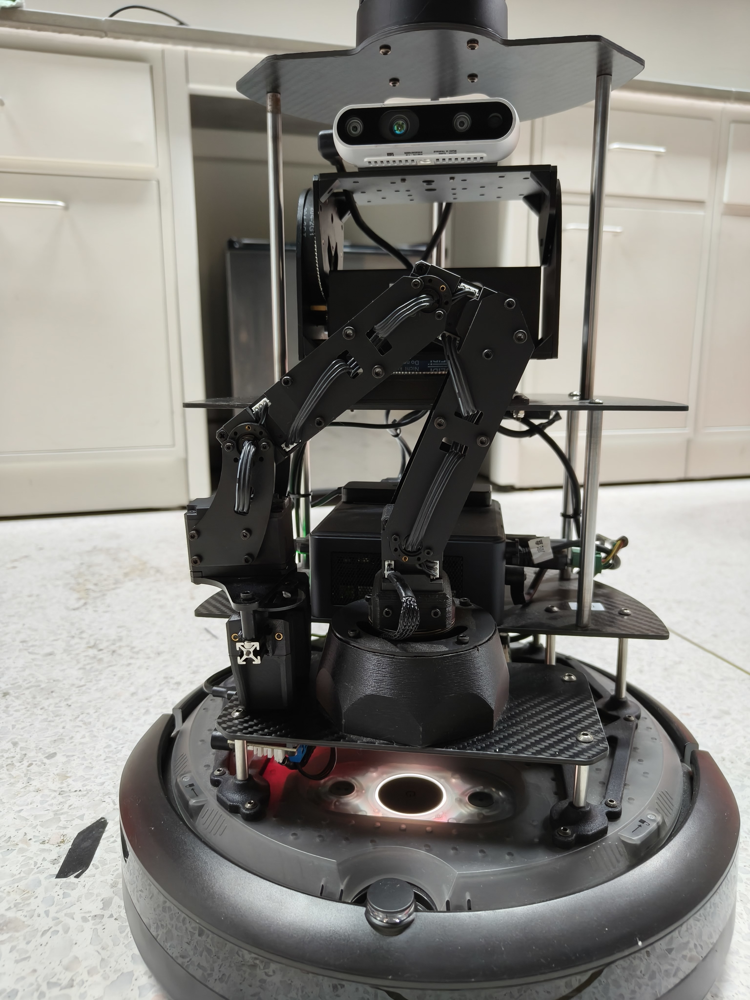

[← Back](https://rpai-lab.github.io/EE211/calendar/)
<!-- [← Back](http://127.0.0.1:4000/EE211/calendar/) -->

<br>

# Lab Session Week-09 -- "Getting Familiar with our Robot"

> **Last Update:** 2024-11-04

<br>

<!-- Table of contents -->
{: .no_toc .text-delta }

1. TOC
{:toc}
{:.no_toc}
---

<br>


## Prerequisites

### Make Sure to Check the Doc written by TA

- [Manual for the robot we use](https://rpai-lab.github.io/EE211/assets/project/robot_doc_for_24fall_project)

### Make sure your ROS_DOMAIN_ID is unique on your PC, as well as your robot per group

e.g.
```

|               |    Robot NUC   | member 1 PC | member 2 PC | member 3 PC | member4 PC |
| ------------- | -------------- | ----------- | ----------- | ----------- | ---------- |
|    Group 1    |       22       |      11     |      12     |     13      |     14     |
|    Group 2    |       23       |      91     |      92     |     93      |     94     |    
|    Group 3    |       24       |      31     |      32     |     33      |     34     |    
|    Group 4    |       25       |      41     |      42     |     43      |     44     |    
|    Group 5    |       26       |      51     |      52     |     53      |     54     |    
|    Group 6    |       27       |      61     |      62     |     63      |     64     |    
|    Group 7    |       28       |      71     |      72     |     73      |     74     |    
|    Group 8    |       29       |      81     |      82     |     83      |     84     |

```


<span style="color: red; font-size: 18px">
    <strong>
<i>
    ***Take Care If You Are a Member of Group 2 !!***
</i>
    </strong>
</span> 

<br>
<br>

### Here is a template of a colcon workspace `src` folder

- [Download the Template SRC](https://raw.githubusercontent.com/RPAI-Lab/EE211/refs/heads/24fall/assets/project/Robot_Workspace_SRC/src.tar.xz)

The structure of `src` should be like:
```
src
├── interbotix_ros_core
├── interbotix_ros_manipulators
├── interbotix_ros_toolboxes
├── iqr_tb4_ros
├── pan_tilt_ros
├── realsense-ros
└── witmotion_ros_driver
```

Please check it carefully

<br>
<br>

## Basic Operations You May Refer to


<br>

***Hardware Startup***

- `ros2 launch iqr_tb4_bringup bringup.launch.py`: Launch the hardware setup

<br>

***Keyboard Teleopration***

- `ros2 run teleop_twist_keyboard teleop_twist_keyboard`: Send velocity command to topic `/cmd_vel`

<br>

***Rviz2 Visualization***

- `ros2 launch iqr_tb4_description display.launch.py`: Visualize the "digital twin" of the robot 

<br>

***SLAM***

- `ros2 launch turtlebot4_navigation slam.launch.py`: Launch slam_toolbox's slam functionality 


- `ros2 launch turtlebot4_viz view_robot.launch.py`: Launch rviz2 for visualization during slam


- `ros2 run nav2_map_server map_saver_cli -f <name_of_your_saved_map>`: Save the map you constructed

<br>
<br>

***Navigation***

- `ros2 launch turtlebot4_navigation localization.launch.py map:=<name_of_your_saved_map.yaml>`: Start localization 


- `ros2 launch turtlebot4_navigation nav2.launch.py`: Launch nav2


- `ros2 launch turtlebot4_viz view_robot.launch.py`: Launch rviz2 for visualization during navigation

<br>

***4-dof Arm***

- You should place the arm in a configuration as below before `ros2 launch iqr_tb4_bringup bringup.launch.py`: 


<!--   -->

and here is a script that you may find it helpful to control the arm: [arm_control_demo.py](https://rpai-lab.github.io/EE211/assets/project/Robot_Workspace_SRC/scripts/arm_controller_demo.py)

<br>

***Pan-Tilt***

- `ros2 launch pan_tilt_bringup panTilt_bringup.launch.py`, then the pan-tilt topics are ready for you, you can publish to the topics to control the pan-tilt.

e.g.
```bash
ros2 topic pub /pan_tilt_cmd_deg pan_tilt_msgs/msg/PanTiltCmdDeg "{yaw: 30.0, pitch: 30.0, speed: 5}"
```
<br>

***Camera***

- `ros2 run realsense2_camera realsense2_camera_node` or `ros2 launch realsense2_camera rs_camera.launch.py` to start the camera node. Then visualize the camera image by using rviz2 or rqt_image_view.


<br>

<br>
